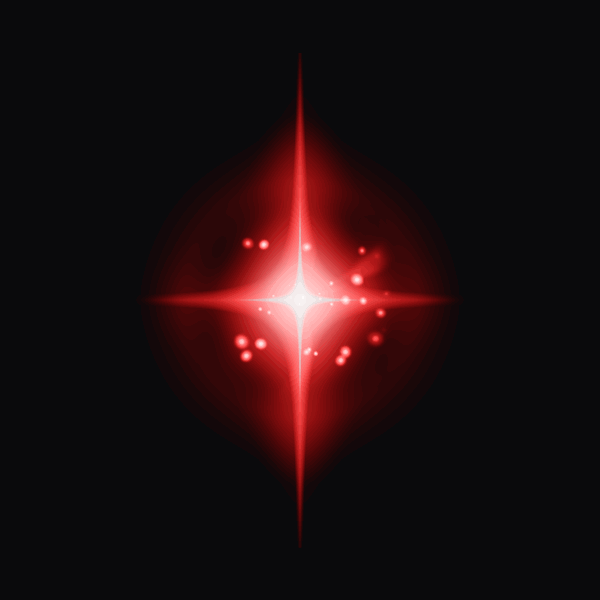

<p align="center">
  <a href="https://abyssalrift.eluvade.com/">
    
  </a>
</p>

<h1 align="center">Rift Echoes</h1>
<p align="center">@eluvade/rift-echoes</p>

<div align="center">
  <a href="https://eluvade.com/">
    
  </a>
</div>

<p align="center">
  <a href="https://www.npmjs.com/package/@eluvade/rift-echoes"></a>
  <a href="https://www.npmjs.com/package/@eluvade/rift-echoes"></a>
  <a href="LICENSE"></a>
</p>

Rift Echoes renders animated, rarity-tiered loot-drop effects ("cargo caches")
in the browser. It's a self-contained **WebGL2 + TypeScript** module with **zero
runtime dependencies** — no three.js, no PixiJS. Each drop is composed from
additively-blended emitter layers rendered into an HDR framebuffer and finished
with bloom and ACES tonemapping.

Built for [Abyssal Rift](https://abyssalrift.eluvade.com) — a 2D space
exploration MMORPG.

**[▶ Live demo](https://eluvade.github.io/rift-echoes/examples/)** &nbsp;·&nbsp; **[Layer × rarity grid](https://eluvade.github.io/rift-echoes/examples/grid.html)** &nbsp;·&nbsp; **[npm](https://www.npmjs.com/package/@eluvade/rift-echoes)**

<p align="center">
  
</p>

## Features

- Six rarity tiers — Common, Uncommon, Rare, Epic, Legendary, Unique — each with
  its own colour, star shape, and particle density.
- Pure WebGL2 instanced rendering; emitters of the same kind batch into a single
  draw call across every live drop.
- HDR pipeline (`RGBA16F` → bloom → ACES) so emissive cores can bloom past 1.0.
- Many drops share one canvas and one renderer; place each by `x`/`y`.

## Install

```sh
npm install @eluvade/rift-echoes
```

### Without a build step (CDN)

The package is a native ES module with zero dependencies, so you can import it
straight from a CDN inside a plain `<script type="module">` — no bundler, no
package manager, just an HTML file:

```html
<script type="module">
  import { RiftRenderer, Rarity } from 'https://esm.sh/@eluvade/rift-echoes@1.0.0';

  // Omit `canvas` and a full-screen one is created and appended for you.
  // All textures are generated procedurally — nothing is fetched.
  const renderer = new RiftRenderer();
  await renderer.ready();

  const dpr = window.devicePixelRatio || 1;
  renderer.createCargoCache({
    rarity: Rarity.Unique,
    x: (innerWidth / 2) * dpr,   // createCargoCache uses device pixels
    y: (innerHeight / 2) * dpr,
    size: 1.5,
  });
</script>
```

[esm.sh](https://esm.sh) is used above; [jsDelivr](https://www.jsdelivr.com)
(`https://cdn.jsdelivr.net/npm/@eluvade/rift-echoes@1.0.0/+esm`) and
[unpkg](https://unpkg.com) (`https://unpkg.com/@eluvade/rift-echoes@1.0.0`) serve
the same module. Pin `@1.0.0` for reproducibility, or drop it to track latest.

## Usage

```ts
import { RiftRenderer, Rarity } from '@eluvade/rift-echoes';

// Pass your own canvas, or omit it to have one appended full-screen.
const renderer = new RiftRenderer();

// Renderer init is async (GL setup); wait before spawning.
await renderer.ready();

const drop = renderer.createCargoCache({
  rarity: Rarity.Legendary,
  x: 400,   // device pixels
  y: 300,
  size: 1.0,
});

// When the drop is collected / despawned:
drop.destroy();
```

## API

### `new RiftRenderer(options)`

`new RiftRenderer()` works with no arguments; the only option is optional.

| option        | type                | description                                                        |
| ------------- | ------------------- | ------------------------------------------------------------------ |
| `canvas`      | `HTMLCanvasElement` | Optional. If omitted, a full-screen canvas is created and appended. |

- `renderer.ready(): Promise<void>` — resolves once textures are loaded and the
  render loop is running.
- `renderer.createCargoCache(params): CargoCache` — spawns a drop. `params`:
  `{ rarity, x?, y?, size? }`.
- `renderer.destroy()` — tears down GL resources and stops the loop.

### `CargoCache`

- `cache.x`, `cache.y` — mutable; move a live drop by assigning.
- `cache.destroy()` — plays the despawn and removes the drop.
- `cache.finished` — `true` once the despawn has fully played out.

### `Rarity` / `RARITY_CONFIGS`

`Rarity` is an enum (`Common`…`Unique`). `RARITY_CONFIGS` exposes the layer
recipe for each tier (colour + ordered emitter layers) if you want to inspect or
fork the visual definitions.


## Examples

Two live harnesses live under `examples/` and are deployed to GitHub Pages:

- **[Single-drop tuning harness](https://eluvade.github.io/rift-echoes/examples/)**
  — `examples/index.html`. Spawn one drop and tune it live: pick the rarity,
  toggle individual layers, override a layer's DMP, and respawn / destroy. URL
  params: `?rarity=<Rarity>`, `?layers=<i,j>`, `?dmp=<a,b,c,d>`,
  `?freeze=<radians>`. Exposes `window.riftRenderer` / `window.riftCache`.
- **[Layer × rarity grid](https://eluvade.github.io/rift-echoes/examples/grid.html)**
  — `examples/grid.html`. Every layer isolated against every rarity tier in one
  canvas, with per-row sliders to tune each layer.

To run them locally: `npm run build`, then serve the repo root with any static
server (e.g. `npx serve .`) and open `examples/index.html` or
`examples/grid.html`.

## Development

```sh
npm run build                     # tsc → dist/
node scripts/shoot.mjs <label> <Rarity> [layers]   # single headless screenshot
node scripts/contact.mjs <label>  # per-layer × per-rarity contact sheet (PNG)
```

## License

[MIT](LICENSE)
