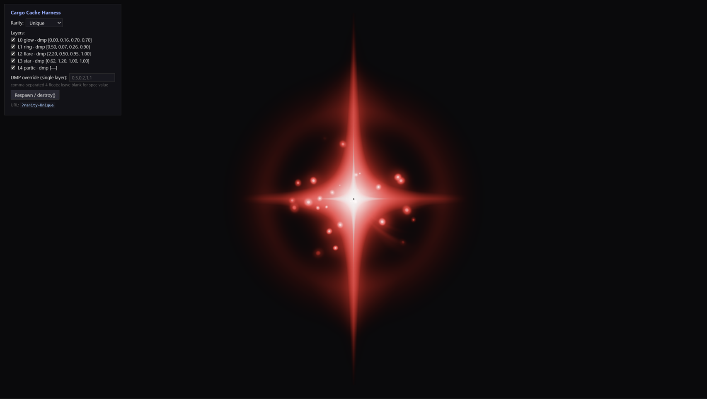
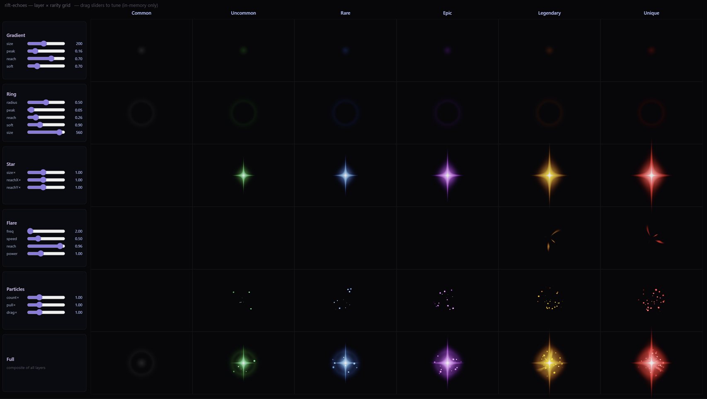

<p align="center">
  <a href="https://abyssalrift.eluvade.com/">
    
  </a>
</p>

<h1 align="center">Rift Echoes</h1>
<p align="center">@eluvade/rift-echoes</p>

<div align="center">
  <a href="https://eluvade.com/">
    
  </a>
</div>

<p align="center">
  
  
</p>

Rift Echoes renders animated, rarity-tiered loot-drop effects ("cargo caches")
in the browser. It's a self-contained **WebGL2 + TypeScript** module with **zero
runtime dependencies** — no three.js, no PixiJS. Each drop is composed from
additively-blended emitter layers rendered into an HDR framebuffer and finished
with bloom and ACES tonemapping.

Built for [Abyssal Rift](https://abyssalrift.eluvade.com) — a 2D space
exploration MMORPG.

**[Live Demo](https://eluvade.github.io/rift-echoes/examples/?rarity=Unique)**

<p align="center">
  
</p>

## Features

- Six rarity tiers — Common, Uncommon, Rare, Epic, Legendary, Unique — each with
  its own colour, star shape, and particle density.
- Pure WebGL2 instanced rendering; emitters of the same kind batch into a single
  draw call across every live drop.
- HDR pipeline (`RGBA16F` → bloom → ACES) so emissive cores can bloom past 1.0.
- Many drops share one canvas and one renderer; place each by `x`/`y`.

## Install

```sh
npm install @eluvade/rift-echoes
```

## Usage

```ts
import { RiftRenderer, Rarity } from '@eluvade/rift-echoes';

// Pass your own canvas, or omit it to have one appended full-screen.
const renderer = new RiftRenderer({ texturePath: '/textures/' });

// Textures load asynchronously; wait before spawning.
await renderer.ready();

const drop = renderer.createCargoCache({
  rarity: Rarity.Legendary,
  x: 400,   // device pixels
  y: 300,
  size: 1.0,
});

// When the drop is collected / despawned:
drop.destroy();
```

## API

### `new RiftRenderer(options)`

| option        | type                | description                                                        |
| ------------- | ------------------- | ------------------------------------------------------------------ |
| `texturePath` | `string`            | Folder (served URL) holding the sprite atlas — see **Textures**.   |
| `canvas`      | `HTMLCanvasElement` | Optional. If omitted, a full-screen canvas is created and appended. |

- `renderer.ready(): Promise<void>` — resolves once textures are loaded and the
  render loop is running.
- `renderer.createCargoCache(params): CargoCache` — spawns a drop. `params`:
  `{ rarity, x?, y?, size? }`.
- `renderer.destroy()` — tears down GL resources and stops the loop.

### `CargoCache`

- `cache.x`, `cache.y` — mutable; move a live drop by assigning.
- `cache.destroy()` — plays the despawn and removes the drop.
- `cache.finished` — `true` once the despawn has fully played out.

### `Rarity` / `RARITY_CONFIGS`

`Rarity` is an enum (`Common`…`Unique`). `RARITY_CONFIGS` exposes the layer
recipe for each tier (colour + ordered emitter layers) if you want to inspect or
fork the visual definitions.

## Textures

The materials sample a small sprite set, loaded from `texturePath` at startup.
The following files must all be present (PNG, power-of-two recommended):

```
T_NOISE.PNG            T_glow_2.PNG     T_Loot.PNG
T_Light_Ring.PNG       T_Cell_1.PNG     T_SPHERE_texture.PNG
```

> The textures under `reference/` used during development are **commercial
> assets** (Gabriel Aguiar — *Unique Loot Drops*) and are **not** redistributed
> with this package. Supply your own equivalent set at `texturePath`.

## Development

```sh
npm run build                     # tsc → dist/
node scripts/shoot.mjs <label> <Rarity> [layers]   # single headless screenshot
node scripts/contact.mjs <label>  # per-layer × per-rarity contact sheet (PNG)
```

`examples/index.html` is a single-drop tuning harness (rarity / layer / DMP
controls). `examples/grid.html` renders the full layer × rarity table live in one
view. Both are served from the repo root.

## License

[MIT](LICENSE)
